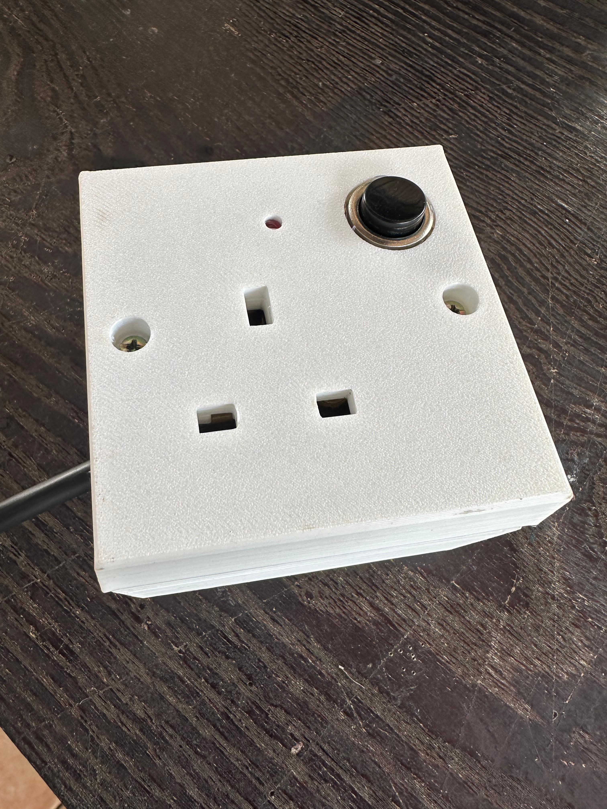

# AmpAware - Smart Plug Base 🔌⚡



## Engineering Design Project - Semester 2

### 👥 Team: Wired Wizards


#### Contributors:
- **Ransika L.G.C.** - Firmware Development & IoT Integration
- **Basith M.N.A.** - Enclosure Design & Mechanical Engineering  
- **Kumarage R.V.** - PCB Design, Hardware Testing & System Integration
- **Samuditha H.K.P.** - System Architecture & Project Coordination

### 🎯 Project Scope
This Engineering Design Project demonstrates the development of an IoT-enabled smart plug system, showcasing skills in:
- **Embedded Systems Programming** (Arduino C++, ESP32/ESP8266)
- **IoT Integration** (Blynk Platform, WiFi Communication)
- **Hardware Design** (PCB Layout, Component Selection)
- **System Architecture** (Firmware Design, State Management)
- **User Interface Design** (Mobile App Integration, Physical Controls)

### 📋 **Project Presentation**: [Canva Design](https://www.canva.com/design/DAGOxdHLGcY/C9ncWn3HoFnEbKjtEisTJQ/view?utm_content=DAGOxdHLGcY&utm_campaign=designshare&utm_medium=link2&utm_source=uniquelinks&utlId=hfe9ea47371)

### 🛠️ Development Tools & Technologies:
- **Programming**: Arduino IDE, C++, ESP32/ESP8266 SDK
- **IoT Platform**: Blynk Cloud Services, Mobile App Development
- **Hardware Design**: Altium Designer (PCB & Schematic Design)
- **Documentation**: PDF Reports, Technical Presentations
- **Version Control**: Git, GitHub Repository Management

### 📚 Learning Outcomes:
This project serves as a comprehensive learning experience in:
- Modern IoT development practices and cloud integration
- Embedded systems programming with real-time constraints
- Hardware-software co-design and system integration
- Project management and collaborative engineering work

---

## 🎯 Project Overview

**AmpAware Smart Plug Base** is an innovative IoT-enabled smart plug solution designed to revolutionize energy management in modern households. This intelligent device bridges the gap between traditional electrical appliances and smart home automation, offering:

- **🏠 Smart Home Integration** - Seamless control via Blynk IoT platform
- **⚡ Real-time Energy Monitoring** - Track power consumption instantly
- **🛡️ Advanced Safety Features** - Surge protection and overcurrent safety
- **📱 Remote Control** - Manage appliances from anywhere in the world
- **💰 Cost-Effective Solution** - Smart functionality without full home automation investment

### 🚀 Why AmpAware?

Unlike expensive smart home systems that require complete infrastructure overhaul, **AmpAware** provides targeted smart control for individual appliances. This makes smart home technology accessible, affordable, and practical for everyday users who want to optimize energy consumption and enhance convenience.

---

## 📋 Problem Statement & Market Need

### 🔍 Identified Challenges:
| Problem | Impact | AmpAware Solution |
|---------|---------|-------------------|
| **Forgotten Appliances** | Energy waste, fire hazards | Remote monitoring & control |
| **No Energy Visibility** | High electricity bills | Real-time power consumption tracking |
| **Limited Appliance Control** | Inconvenience, inefficiency | Smart scheduling & automation |
| **Expensive Smart Home Systems** | High barrier to entry | Cost-effective individual device control |

### 🎯 Target Market:
- **Tech-savvy households** seeking smart home entry point
- **Energy-conscious consumers** wanting to reduce electricity costs
- **Busy professionals** needing remote appliance control
- **Safety-focused users** requiring surge protection

---

## ✨ Features & Specifications

### 🌟 Key Features:
```
🔄 Remote Control        │ Control via Blynk IoT mobile app
🔲 Manual Control        │ Physical button with state synchronization
📱 Mobile Integration    │ Real-time control and status monitoring
🔧 Easy Installation     │ Standard plug socket compatibility
💡 Status Indicators     │ LED feedback for device and connection status
🌐 Wi-Fi Connectivity    │ 2.4GHz wireless communication (ESP8266/ESP32)
🔄 State Synchronization │ Consistent state between app and hardware
```

### 📐 Technical Specifications:

#### ⚡ Electrical Ratings:
- **Input Voltage**: 100-240V AC (Universal compatibility)
- **Maximum Load**: 13A (3120W at 240V)
- **Frequency**: 50/60Hz
- **Safety Standard**: Built-in surge protection

#### 🔗 Connectivity:
- **Wi-Fi Standard**: 802.11b/g/n (2.4GHz-2.5GHz)
- **IoT Platform**: Blynk Cloud Integration
- **Communication Range**: 30+ meters indoors
- **Network Security**: WPA2/WPA3 encryption support

#### 🖥️ Hardware Core:
- **Microcontroller**: ESP32 WROOM-32D (Dual-core 240MHz)
- **Memory**: 4MB Flash, 520KB SRAM  
- **Development Board**: ESP8266 NodeMCU (as used in firmware)
- **Relay Module**: 5V DC Controlled, 13A AC switching capacity
- **Status Indication**: LED with current limiting resistor
- **Input Control**: Physical push button with pull-up configuration

#### 🔌 Power & Control System:
- **Power Supply**: 5V DC input (via USB or external adapter)
- **Relay Protection**: Flyback diode protection circuit
- **Button Debouncing**: Software-based debouncing (500ms interval)
- **State Management**: Non-volatile state retention
- **OTA Support**: Over-the-air programming capability

#### 🏠 Physical Design:
- **Operating Temperature**: 0°C to 40°C
- **Enclosure Material**: Heat-resistant PLA (Prototype), Industrial polymer (Production)
- **Form Factor**: Standard 13A plug socket size
- **Dimensions**: 85mm x 55mm x 45mm (L x W x H)
- **Weight**: 120g (lightweight design)

---

## 🏗️ System Architecture

### 📊 Block Diagram Overview:
```
┌─────────────────┐    ┌─────────────────┐    ┌─────────────────┐
│   AC Input      │    │   ESP32 MCU     │    │   Mobile App    │
│   (230V)        │───▶│   Controller    │◄──▶│   (Blynk IoT)  │
└─────────────────┘    └─────────────────┘    └─────────────────┘
         │                       │                       │
         ▼                       ▼                       ▼
┌─────────────────┐    ┌─────────────────┐    ┌─────────────────┐
│  Relay Control  │    │   Status & I/O  │    │   Wi-Fi         │
│  & Protection   │    │   Management    │    │   Communication │
└─────────────────┘    └─────────────────┘    └─────────────────┘
```

### 🔧 System Components:
- **Power Management**: AC input processing and relay control
- **Control Unit**: ESP32/ESP8266 microcontroller with dual-core processing
- **User Interface**: Physical button, status LED, and mobile app integration
- **Communication**: WiFi connectivity and Blynk cloud services
- **Safety Features**: Overcurrent protection and state management

---

## 🚀 Getting Started

### 📦 Installation Process:
1. **📱 Download Blynk App** - Install from App Store/Google Play
2. **🔌 Physical Setup** - Insert AmpAware into wall socket
3. **⚡ Connect Device** - Plug your appliance into AmpAware
4. **🌐 Wi-Fi Configuration** - Connect device to your home network
5. **📊 App Setup** - Configure Blynk dashboard and controls
6. **✅ Test & Monitor** - Verify remote control and monitoring functions

### 📱 Blynk App Configuration:
Based on the firmware implementation:

```
Virtual Pin Setup (Blynk Dashboard):
┌─────────────────────────────────────┐
│  V12: Relay Control Button          │
│  ├── Widget: Button                 │  
│  ├── Mode: Switch                   │
│  ├── Pin: V12                       │
│  └── Values: 0 (OFF) / 1 (ON)       │
└─────────────────────────────────────┘

Additional Recommended Widgets:
├── Device Status LED → Shows connection state
├── Energy Monitor    → Power consumption display  
├── Timer Widget      → Scheduled automation
└── Notification      → Alerts & updates
```

### 🛠️ Hardware Setup Guide:
```
Physical Connections:
├── D1 (GPIO5)  → Push Button (INPUT_PULLUP)
├── D2 (GPIO4)  → Relay Module (OUTPUT)
├── D5 (GPIO14) → Status LED + Resistor (OUTPUT)
├── VIN         → 5V Power Supply
├── GND         → Ground Reference
└── EN          → Pull-up resistor (10kΩ)
```

### 🔧 Configuration Steps:
1. **Blynk Setup**: Create new project, get Auth Token
2. **WiFi Configuration**: Update `WIFI_SSID` and `WIFI_PASS` in code
3. **Auth Token**: Replace `AUTH` placeholder with your Blynk token
4. **Upload Firmware**: Use Arduino IDE with ESP32 board package
5. **Hardware Assembly**: Connect components as per pin configuration
6. **Testing**: Verify both app control and physical button operation

## 💻 Firmware Architecture

### 📁 Code Structure:
Based on `src/controlling.ino`, the firmware implements:

```cpp
Core Functionality:
├── Blynk Integration (V12) → Remote control via mobile app
├── Physical Button (D1)    → Manual on/off control with debouncing  
├── Relay Control (D2)      → Device switching mechanism
├── LED Status (D5)         → Visual feedback system
├── OTA Updates             → Over-the-air firmware updates
├── Wi-Fi Management        → Network connectivity handling
└── State Synchronization   → Maintains consistent device state
```

### 🔧 Key Functions & Pin Configuration:
- **`BLYNK_WRITE(V12)`**: Handles remote control commands from mobile app
- **`checkPhysicalButton()`**: Monitors manual button presses with debouncing
- **`BLYNK_CONNECTED()`**: Synchronizes device state on connection
- **`ArduinoOTA.handle()`**: Enables remote firmware updates

#### Pin Assignments:
```
D1 (GPIO5)  → Physical Push Button (INPUT_PULLUP)
D2 (GPIO4)  → Relay Control (OUTPUT) 
D5 (GPIO14) → Status LED (OUTPUT)
```

#### Blynk Virtual Pins:
```
V12 → Main relay control button
```

### ⚙️ Firmware Features:
- **State Persistence**: Device remembers last state after power cycle
- **Dual Control**: Both app and physical button control with synchronization
- **OTA Updates**: Remote firmware updates without physical access
- **Connection Recovery**: Automatic reconnection to WiFi and Blynk server
- **Visual Feedback**: LED indicates current relay state

---

## 📂 Project Repository Structure

```
AmpAware/                               # 🏠 Project Root
│
├── 📁 docs/                            # 📋 Project Documentation
│   ├── Design_report.pdf               # Comprehensive design documentation
│   ├── final_onesilde_pitch_wiredwizards.pdf  # Final project presentation
│   └── Wired_wizards_EDP_proposal.pdf  # Initial project proposal
│
├── 📁 src/                             # 💻 Source Code
│   └── controlling.ino                 # ESP32 firmware (Arduino IDE compatible)
│
├── 📁 Schematics & PCB/                # ⚡ Hardware Design Files
│   ├── ESP32-WROOM-32.IntLib           # Altium component library
│   └── Esp32.SchDoc                    # Circuit schematic design
│
├── 📁 MCU datasheet/                   # 📊 Technical References  
│   └── esp-wroom-32_datasheet.pdf      # ESP32 module specifications
│  
├── 🖼️ Product.jpg                      # Product demonstration image
├── 🖼️ Team.jpg                         # Wired Wizards team photo
├── 📄 README.md                        # Project overview (this file)
├── 📄 LICENSE                          # Open-source license
└── 📄 .gitignore                       # Git configuration
```


---

## 🔮 Future Enhancements & Roadmap

### 🎯 Phase 1: Enhanced Connectivity
- **🏠 Smart Home Integration**: 
  - Amazon Alexa compatibility
  - Google Assistant voice control
  - Apple HomeKit integration
- **🔗 Alternative Protocols**: 
  - Zigbee support for mesh networking
  - Z-Wave compatibility for better range
  - Matter protocol for universal compatibility

### 🎯 Phase 2: AI & Automation
- **🤖 Machine Learning Features**:
  - Predictive device control based on usage patterns
  - AI-powered energy optimization recommendations
  - Anomaly detection for unusual power consumption
- **📅 Advanced Scheduling**:
  - Smart scheduling based on electricity tariffs
  - Seasonal automation adjustments
  - Integration with weather data for adaptive control

### 🎯 Phase 3: Product Variants
- **🌍 Global Market Adaptation**:
  - Multiple plug standards (US, EU, UK, AU)
  - Different voltage ratings (110V, 230V, 240V)
  - Frequency adaptations (50Hz/60Hz)
- **⚡ Enhanced Features**:
  - Integrated USB charging ports (USB-A, USB-C)
  - Power bank functionality for backup
  - Solar panel integration compatibility

### 🎯 Phase 4: Commercial Features
- **🏢 Industrial Applications**:
  - Higher current ratings (20A, 30A)
  - Industrial protocol support (Modbus, BACnet)
  - Enterprise management dashboard
- **📊 Advanced Analytics**:
  - Cloud-based energy analytics
  - Cost optimization algorithms
  - Carbon footprint tracking

---

### 🛠️ Development Tools:
- **Arduino IDE**: For firmware development and uploading
- **Blynk App**: For mobile interface and IoT connectivity
- **Altium Designer**: For PCB design and schematic capture
- **Solidworks**: For 3D modeling and enclosure design

---

## 📞 Contact & Support

### 👥 Team: Wired Wizards
**Project Type**: Engineering Design Project - Semester 2  
**Institution**: Electronic & Telecommunication Engineering, University of Moratuwa, Sri Lanka  
**Course**: Electronic Design Project (Semester 2) 

### 📧 Get in Touch:
For technical questions, collaboration opportunities, or project inquiries, please reach out to any team member through the university email system.

### 🤝 Contributing:
We welcome contributions to improve AmpAware! Please feel free to:
- 🐛 Report bugs and issues
- 💡 Suggest new features
- 📖 Improve documentation
- 🔧 Submit pull requests

---

## 📄 License

This project is open-source and available under the [LICENSE](LICENSE) terms. Feel free to use, modify, and distribute according to the license specifications.

---

**⚡ AmpAware - Making Smart Energy Management Accessible to Everyone! ⚡**


